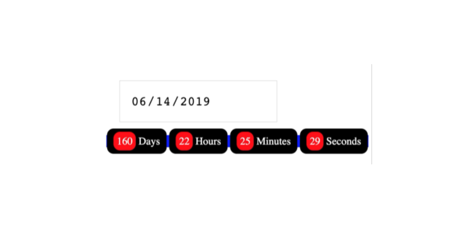

# Countdown-Timer
Pick a date and see how much time is left with a dynamically updating counter.

# Features
-Local Storage to store end time.
-Time Interval and clear for website updates.
-Date calculation: let t = Date.parse(d) - Date.parse(currentDate);
-Math to get time: let seconds = Math.floor((t / 1000) % 60);

# Image

